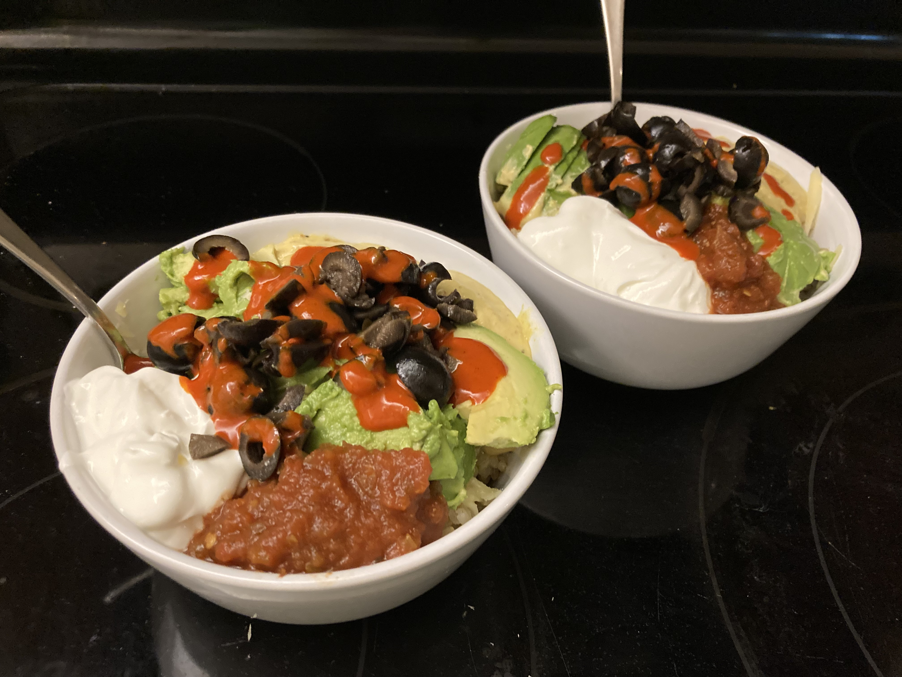

⚠️ A note to readers: This document is written by Aiden for his own use as an individual, therefore general usability is not guaranteed, especially for those that are not Aiden.

# Document Sections

- [Purpose Statement](#purpose-statement)
- [Term Definitions](#term-definitions)
- [Document Organization](#document-organization)
- [Meals for Self](#meals-for-self)
- [Feeding the Crowds](#feeding-the-crowds)
- [Fancy Food](#fancy-food)
- [Lavish Treats](#lavish-treats)
- [Hobby Foodstuff](#hobby-foodstuff)
- [Recipe Appendix](#recipe-appendix)
- [Ingredient Appendix](#recipe-appendix)

# Purpose Statement

The purpose of this document is to provide a document for Aiden, by Aiden, to improve his intentionality and efficiency in making food for himself and others while being in alignment with his food goals. The food goals of Aiden Nelson are:

⚡️
Be able to whip up something good fast. 
- The most important thing to Aiden is to be able to procure an enjoyable meal but not at the cost of a huge amount of time. In other words, the goal is to have the highest yum to make-speed ratio.

🐀
Meal prep as much as possible to prevent scrounging behavior. 
- Now that Aiden has finished his student-career he wants to move on from microwave-baked potatoes and box Mac n’ Cheese. To increase the likelihood of procuring a quality meal the right ingredients need to be present and ready to assemble.  This involves buying certain things while shopping, preparing a list of things to get before going shopping, and having a plan of what to do with said ingredients, how to prepare them for ready-use, and when to prepare and use them.

🔮
Have lots of options to account for as many conceivable meal-related scenarios as possible.
- Ideally this document could be consulted for a range of different situations from trying to feed the self with something reasonably quick-to-make and healthy, to trying to feed a crowd of gluten-free vegans something thats still yummy for carnivores.

# Term Definitions

- **Tasty** - Tastes good.
- **Healthy** - Feels healthy to eat or is actually healthy according to science.
- **Yum/yummy** - Tastes good when eating and feels healthy when eating and after eating.

# Document Organization

Recipes for substances that are typically assembled into greater meals are located in the [Recipe Appendix](#recipe-appendix). Ingredients that are used in the recipes of this document are listed in [Ingredient Appendix](#recipe-appendix), along with information about what recipes they are used for and where they can be obtained.

# Meals for Self

## Yum Bowl

**Description:**
The classic yum bowl is served by the resturaunt chain Cafe Yum that spawned out of Eugene Oregon. The key part of this meal is the sauce. Overall this meal feels good in the body and tastes real good.

**Ingredients:**
- yum sauce 
- short grain brown rice
- black beans (optional)
- cheese (any cheese works. optional)
- black olives (optional)
- sour cream (can substitute with greek yogurt. optional)
- avacado (optional)
- cilantro (optional)
- siracha or goopy hot sauce (optional) 

**Preparation:**
1. Create yum sauce ~ 1 hour. Use [these directions](#yum-sauce). The yum sauce takes effort to create, but a lot of it can be made at once and it doesn't go bad quickly. The sauce can be stored directly in the blender glass. 
2. Cook brown rice ~ 1 hour.  Use [these directions](#brown-rice). The rice takes a bit to make but does not require active participation. Cook using a rice cooker or instant pot.
3. Chop olives ~ 5 min. Chop black olives into slices and store in tupperware container for ready use.
4. Grate cheese ~ 5 min. Grate cheese and store in tupperware container for ready use.

**Execution:**
1. Fill bowl with rice and microwave. Push rice to one side of the bowl to make room for the beans.
2. Fill a strainer with a half can of black beans and wash. Put beans into bowl.
3. Throw all other ingredients on to preffered proportions. Be careful not to overflow. Ingredients can be arranged in a pretty fashion for style bonus.

## Chia Bowl

**Description:**
This is an incredibly easy breakfast to produce.

**Ingredients:**
- chia seeds
- granola
- milk (coconut milk is preferable)

**Preparation:**
No preparation is needed unless creating [your own granola](#granola).

**Execution:**
1. Fill bowl with a half cup of chia seeds.
2. Add milk for the seeds to soak up. Let soak for 3 min.
3. Add granola on top of milk-soaked chia seeds.

## Yogurt and Granola

**Description:**
This is an incredibly easy breakfast to produce.

**Ingredients:**
- granola
- greek yogurt 
- sliced banana (optional)
- blueberries (optional)
- sliced strawberries (optional)

**Preparation:**
No preparation is needed unless creating [your own granola](#granola).

**Execution:**
1. Fill bowl with a big spoonful of greek yogurt.
2. Add granola on top of yogurt.
3. Add fruit on top of granola and yogurt. 

## Freezer Burrito

**Description:**
Not the healthiest, but very filling and easy to prep in mass.

**Ingredients:**
- see recipe for [freezer batch burritos](#freezer-batch-burritos)

**Preparation:**
1. Create and freeze [freezer batch burritos](#freezer-batch-burritos) ~ 3-4 hours.
2. Move the desired number of burritos from the freezer to the fridge to thaw at least 10 hours in advance to eating.

**Execution:**
1. Remove burrito from fridge and place in oven.
2. Bake until crisp (convection oven ideal).

# 👨‍👩‍👧‍👦 Feeding the Crowds 

TODO:
- Nachos
- Spaghetti
- Mac and cheese

# 🎩 Fancy Food

TODO:
- Paella
- Mexican Lasagna
- Lasagna

# 🍪 Lavish Treats

TODO:
- Chocolate chip cookies
- Snickerdoodle cookies
- Double chocolate chip cookies

# Hobby Foodstuff

TODO:
- Kombucha
- Herb plants - spicy oregano 

# Recipe Appendix

## 🌯 Burritos
### Freezer Batch Burritos

**Description:**
Burritos aren't the healthiest, especially frozen ones, but they sure are filling and convenient.
Making them yourself also grants a bit more control over what goes into them.
Forget to make a meal? Got a little lazy? Never fear! Burrito is here!

**Ingredients:**
- 5 cans of black beans (can substitute with pinto)
- 5 cups of cooked rice (fry in salsa first to make more delicious)
- 1/2 a block of chedder cheese
- 2 cans of olives (optional) 
- 16 oz or 1/2 a tall container of greek yogurt
- 2 shot glasses of hot sauce
- 5 cups of chopped cooked chicken (optional. If not included then this meal is recipe is vegetarian)
- Many tortillas (30+)

**Directions:**
1. Combine all ingredients into a large bowl.
2. Mix ingredients in bowl with hands until well mixed. It should look something like the picture below.
 

3. Scoop some mixture into a tortilla and fold into burrito. 
4. Put burrito to side. 
5. Repeat steps 3-4 until there is no more mixture left. This should leave you with several stacks of burritos (see example stack below).
 

6. Place burritos into plastic bag and store in freezer. Several plastic bags may be needed.
 

This recipe was inspired by Ian Sloan.

## 🍛 Curries
### Thai Red Curry with Chicken

**Description:** Need something with protein and spice to go with your rice? Well companion, you have found your meal! This recipe is a variant of [this recipe](https://www.paintthekitchenred.com/instant-pot-thai-red-curry/#ingredients).

**Ingredients:**
- 3 Tbsp Thai red curry paste
- 14 oz. coconut milk full fat
- 1 lb boneless skinless chicken thighs or breasts, sliced into thin bite-size pieces
- 1/4 cup chicken broth
- 2 Tbsp fish sauce more to taste
- 2 tsp brown sugar or palm sugar, to taste
- 1 Tbsp lime juice
- 1 cup bell peppers (any color), chopped
- 1 cup carrots sliced
- 1/2 cup onion chopped
- 1/2 cup bamboo shoots canned (optional)
- 4 lime leaves slightly bruised (optional)
- 12 Thai Basil leaves (optional)

**Insta-Pot Directions:**
1. Stir together red curry paste and 1/2 can of coconut milk in Insta Pot.
1. Turn on Saute Mode and saute until mixture is bubbly, a minute or two. Use a splatter screen if necessary, to guard against splatters from the coconut milk.
3. Turn off Instant Pot.
4. Stir in chicken, remaining coconut milk, and chicken broth or water.
5. Pressure cook on high pressure for 4 minutes. 
6. Allow the pressure to release naturally (NPR) and wait for float valve to be in the down position. This may take 15 to 30 minutes. 
7. Select Saute mode.
8. Stir in fish sauce, brown sugar, lime juice, bell pepper, carrot, onion, bamboo shoots, and lime leaves.
9. Cook until vegetables are crisp-tender, about 3 to 5 minutes.  Don’t overcook, as the vegetables will continue to cook in the residual heat.
10. Taste and adjust with more fish sauce, brown sugar or lime juice.
11. Stir in the Thai basil leaves.
12. Serve with jasmine rice or store in containters to freeze.

## 🥫 Sauces
### Yum Sauce

**Description:** The classic yum sauce is served by the resturaunt chain Cafe Yum that spawned out of Eugene Oregon. This recipe is a knock-off that doesn't taste all that much like official Yum sauce, but it tastes good still and can be used in placement of the actual stuff. This recipe is a variant of [this recipe](https://www.melskitchencafe.com/yum-yum-bowls/).

**Ingredients:**
- 1 cup avocado, canola, or vegetable oil
- 1 cup almonds
- 1 can of Butter beans (a can of Great Northern or Garbanzo beans can be substituted), rinsed and drained
- 1 cup water
- 1 can of light coconut milk
- 1 cup of lemon juice (if fresh this will be about 6 large lemons)
- 4 garlic cloves, minced
- 1 teaspoon salt
- 2 pinches of ground black pepper
- 2 teaspoon curry powder
- 2 teaspoon dried oregano
- 3 to 4 tablespoons chopped fresh cilantro (or just rip some off and let it get chopped in the blender)
- 1 cup nutritional yeast

**Blender Directions:**
1. Add the oil, almonds, beans and water to a blender. Blend until very smooth.
2. Add the coconut milk, lemon juice, garlic, salt, pepper, curry powder, oregano, cilantro and nutritional yeast. Blend again until creamy and smooth.
3. Add additional water and/or lemon juice to thin out the sauce if needed.
4. Store in the refrigerator until ready to serve.

## 🍚 Rice

### Long Grain White Rice

**Ingredients:**
- long grain white rice
- water
- salt

**Insta-Pot Directions:**
1. Fill pot with cups of long grain white rice.
2. Fill pot with 1 1/2 cup of water per cup of rice used. Rinse rice before adding.
3. Add one half-teaspoon of salt to pot for each cup of rice used.
4. Set pot to high-pressure (if not already set).
5. Cook for 5 minutes on high pressure.

### Short Grain Brown Rice

**Ingredients:**
- short grain brown rice
- water
- salt

**Insta-Pot Directions:**
1. Fill pot with cups of short grain brown rice.
2. Fill pot with 1 1/4 cup of water per cup of rice used. Rinse rice before adding.
3. Add one half-teaspoon of salt to pot for each cup of brown rice used.
4. Set pot to high-pressure (if not already set).
5. Cook for 30 minutes on high pressure.

### Jasmine Rice

**Ingredients:**
- jasmine rice
- water (or broth)
- salt

**Insta-Pot Directions:**
1. Fill pot with cups of jasmine rice.
2. Fill pot with 1 1/4 cup of water per cup of rice used. Rinse rice before adding.
3. Set pot to high-pressure (if not already set).
4. Cook for 4 minutes on high pressure.
5. Allow Keep Warm mode for 10 minutes.

## Miscellaneous

Nothing here so far.

### Granola

TODO: granola

# Ingredient Appendix

### Nutritional Yeast

**Used to make:**
- [Yum Sauce](yum-suace)

**Can find at:**
- Winco

### Chia Seeds

**Used to make:**
- [Chia bowl](chia-bowl)

**Can find at:**
- Costco
